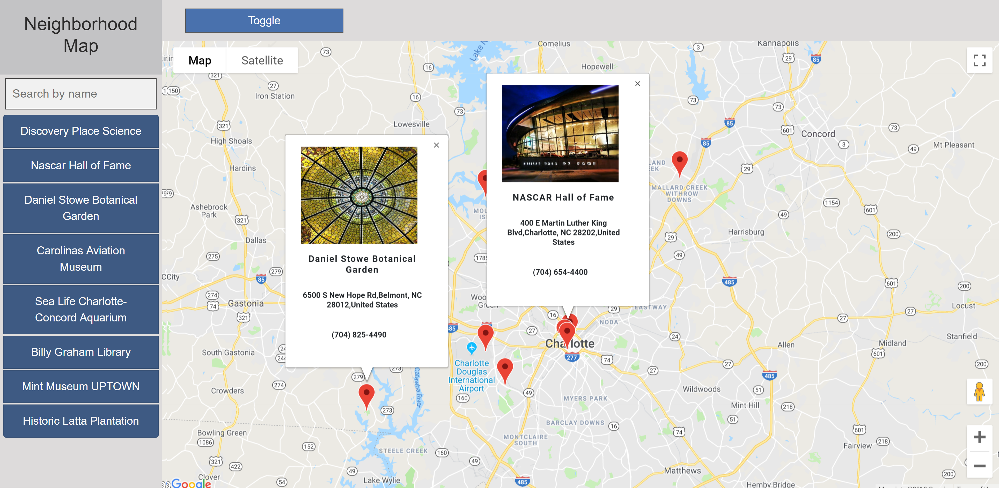
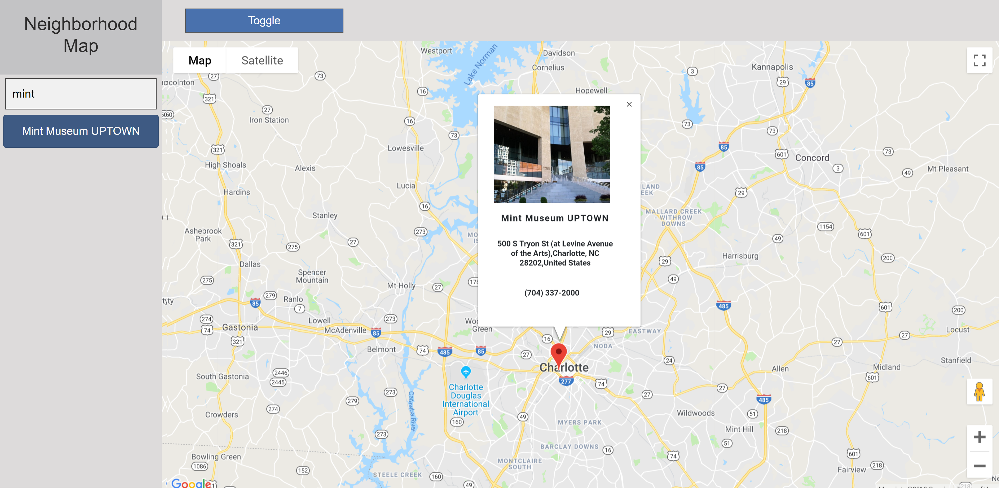

# Neighborhood Map(React)

## About
  This is a single page application created for final project of Udacity's Front-End Nanodegree program. It demonstrates the ability to use React, Google Maps API and Foursquare API.

## Features
  A Google Map implementation shows you the best places to visit in Charlotte, NC. The site is fully responsive on every screen size. The Application contains map with generated markers located at Points of Interests.  Left sidebar has a searchable list of the locations.

## Installation
  1.	Clone project 
  2.	Change directory to this app in terminal using cd/……
  3.	To install package, enter npm install
  4.	To start React App, enter npm start

##  Technologies and Packages:
  1.	Google Maps API
  2.	Bootstrap
  3.	React.js
  4.	Foursquare API
  5.	axios
  6.	Service Worker 
  7.	Aria roles

# NOTE
Foursquare has limited request quota for their API. When server respond with quota exceeded error and markers are not shown then you have to wait 24h.

## Screenshot

